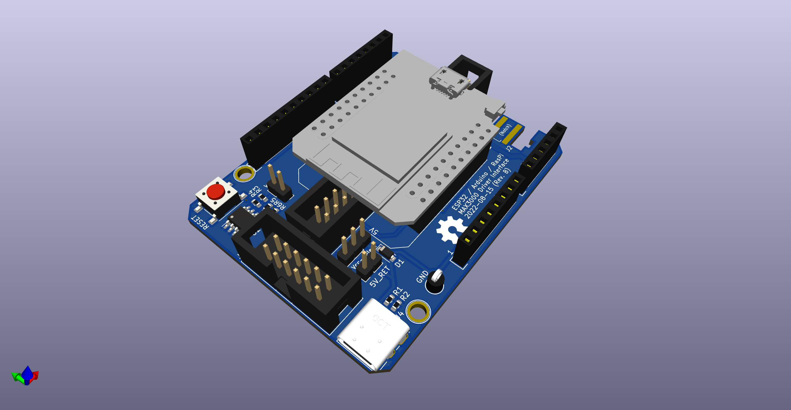
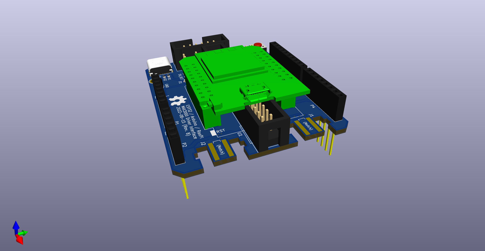

# FlippyControl

Arduino / ESP32 Shield for controlling the [Luminator MAX3000](https://github.com/NietoSkunk/FlippyDriver) Flip Dot driver.

In addition to connecting the appropriate pins of the microcontroller to the data harness, it also includes pads to connect two Wii Extension Controllers (including Classic Controller, Pro Controller, etc), a USB-C 5V power input, and selectable Vcc outputs.




## Cloning repository (with Submodules)

```bash
$ git clone --recurse-submodules git@github.com:NietoSkunk/FlippyControl.git
```

## Production notes

* None yet

## Data Harness

| Pin | # | # | Pin |
| --- | - | - | --- |
| VCC | 1 | 2 | GND |
| MOSI | 3 | 4 | PULSE_ENABLE |
| LATCH | 5 | 6 | COL_PULSE_N |
| CLK | 7 | 8 | ROW_PULSE_N |
| RESET | 9 | 10 | I2C SCL |
| N/C | 11 | 12 | I2C SDA |

